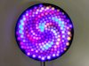
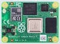
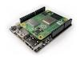

# Fibonacci Pi

[Fibonacci256](https://www.evilgeniuslabs.org/fibonacci256) (and others, at some point) driven with CircuitPython on a Raspberry Pi.

## Hardware

I'm currently using:

-  [Fibonacci256](https://www.evilgeniuslabs.org/fibonacci256)
-  [Raspberry Pi Compute Module 4](https://www.raspberrypi.com/products/compute-module-4/?variant=raspberry-pi-cm4102008) (8 GB eMMC, Wireless, 2 GB RAM)
-  [Piunora](https://www.crowdsupply.com/diodes-delight/piunora) carrier board.

## Software

- [Adafruit Blinka](https://pypi.org/project/Adafruit-Blinka)
- [CircuitPython](https://learn.adafruit.com/welcome-to-circuitpython)
- [FancyLED Library](https://learn.adafruit.com/fancyled-library-for-circuitpython)

Run with:

```
sudo python3 palette_demo.py
```
